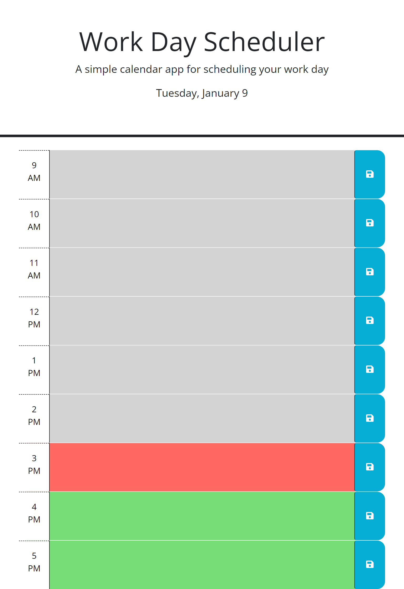

# <Work Day Scheduler>

## Description

https://dnoon23.github.io/work-day-scheduler/

The project was to develop a day planner.  The web page lists the current date and day of the week at the top.  Below are 9 rows representing the hours of the day from 9AM to 5 PM.  Each row is colored based on the time of the day when the website is accessed.  If the row represents an hour that has passed it is colored greay, the present hour is colored in red, and any hours in the future are colored green.  In each row there is a text area that the user can type in plans for the day.  Once something is entered in the text field the user can hit the save button on the right side of each row to save the text in the row.  Saves persist through page refreshes so it can be updated through the day.  There were many diffuculties in developing this page.  The most difficult part was getting the page to recognize which button was pushed and then save the correct text to local data.  Coloring each row correctly was also a challenge.

## Installation

To run the program you have to open it in a web browser.

## Usage

After the site is launched the current day is listed at the top of the page and the rows representing the hours of the day are colored.  Grey for hours past, red for the current hour, and green for hours of the future.  Each row has a text field that the user can click on and type in information such as what are their plans for that hour.  On the right side of each row is a blue button to save whatever information is typed.  Each button only saves the data of the row it is on so every row needs to be saved individually.  Saves are stored so the page can be closed or reopened and saved entries will remain populated.

## Credits

Some code modified from code taken from: 
https://git.bootcampcontent.com/

## Features

Checks the current day and hour.  The day is listed at the top and the hour determins the color of the rows.  Grey for hours past, red for the current hour, and green for hours of the future.  There is also a save feature to keep text that was typed in the text area for each hour.  Saved data repopulates on refresh.

